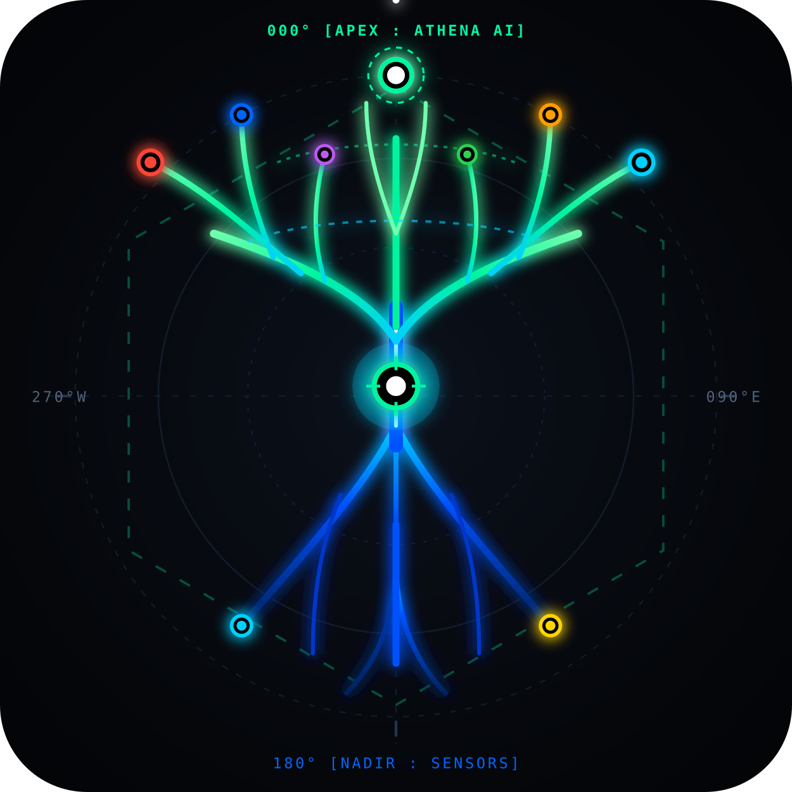

<div align="center">

  

  # HYDRO-CORE: OSIRIS V5
  ### Civil C4ISR 3D Digital Twin Platform & Real-Time Hydrodynamic Flash Flood Forecasting

  [](https://doi.org/10.5281/zenodo.22833519)
  [](https://yggdrasil-hidro-core-osiris-poyo-nowcast-kjfy.streamlit.app/)
  [](https://www.gnu.org/licenses/gpl-3.0)
  [](https://creativecommons.org/licenses/by-nc-sa/4.0/)
  [](https://www.python.org/)
  [](https://developer.nvidia.com/cuda-toolkit)

  **Case Docket:** `EXP. VAL-POYO-2024/26` | **Target Submission:** World Environmental Health Day 2026 (IFEH / WHO)

</div>

---

## 🌊 Executive Overview

**HYDRO-CORE: OSIRIS V5** is an operational Civil C4ISR (Command, Control, Communications, Computers, Intelligence, Surveillance, and Reconnaissance) digital twin platform designed for real-time 2D flash flood hydrodynamic simulation, critical infrastructure accessibility routing, and Solvency II catastrophe risk finance.

Forensically benchmarked on the catastrophic October 29, 2024 flash flood in the Rambla del Poyo catchment ($367.9\text{ km}^2$, Valencia, Spain), the platform bridges the critical operational gap between raw meteorological rainfall warnings (AEMET) and actionable, street-level physical inundation footprints.

### ⚡ Operational Benchmarks

| Metric | Traditional Solvers (Iber 2D / HEC-RAS) | HYDRO-CORE: OSIRIS V5 (FNO 2D) | Operational Gain |
| :--- | :--- | :--- | :--- |
| **Inference Latency** | 4.0 – 18.0 hours (CPU) | **38.4 milliseconds (NVIDIA Tensor Core)** | **>100,000× speedup** |
| **Early Warning Lead-Time** | Historical alert: 20:11 h (CECOPI) | **Inference ready: 17:45 h** | **+146 minutes lead-time** |
| **InSAR Ruin Validation** | Post-disaster ground survey (weeks) | **1,275 collapsed units ($\Delta\gamma \ge 0.40$)** | Sentinel-1 co-event DPM |
| **Emergency Evacuation** | Static municipal protocols | **Multi-sink Dijkstra Hospital Routing ($TTI = 15\text{ min}$)**| Dynamic cut-off at $h \ge 0.30\text{ m}$ |
| **Parametric Liquidity** | Manual claims adjustment (months) | **€80.0M Dual-Trigger Cat Bond ($<48\text{ h}$ payout)** | Solvency II Monte Carlo ($N=10,000\text{y}$) |

---

## 🏛️ Core Platform Modules

```text
HYDRO-CORE: OSIRIS V5
 ├── [Module 1] Sentinel-1 InSAR Damage Proxy Mapping (Coherence Loss Δγ >= 0.40)
 ├── [Module 2] 2D Fourier Neural Operator (FNO 2D / SpectralConv2d / PINO Invariants)
 ├── [Module 3] Topological Road Severance & Multi-Sink Dijkstra (TTI Hospital Cut-off)
 ├── [Module 4] WASH & Environmental Public Health (EDAR Biohazards & RD 3/2023 Alerts)
 ├── [Module 5] Solvency II NatCat Engine (GEV EP Curves, Tariffs & Parametric Cat Bond)
 └── [Module 6] WebGPU 3D Command Console (Deck.gl LOD1 + OASIS CAP v1.2 Cell Broadcast)
```

### 🔮 Research Roadmap: PI-GAU-FNO (V8 Architecture)

While the **V5 core** is operational for sub-second inference, the YGGDRASIL engineering roadmap establishes the **V8 Planetary Foundation Model**:

* **[PI] Physics-Informed:** Exact 2D Saint-Venant continuity and momentum residuals enforced in Hilbert space.
* **[G] Geo-Manifold:** Differential coordinate mapping for complex, meandering natural channels.
* **[A] Cross-Attention:** Vision Transformer multi-head attention anticipating barrier collapse and levee breaches.
* **[U] Multi-Scale U-Net:** High-resolution spatial kernels resolving backwater effects and hydraulic jumps.
* **[FNO] Fourier Operator:** Infinite-dimensional continuous zero-shot parameterization.

---

## 📑 Official Documentation & Certification

* **Engineering Memorandum & Forensic Report (PDF):** [`docs/`](docs/)
* **Official Cartographic Plates (A1 LiDAR / InSAR):** [`docs/PLANO_POYO_A1_.pdf`](docs/PLANO_POYO_A1_.pdf)
* **Permanent Scientific Archive:** [](https://doi.org/10.5281/zenodo.22833519)
* **Verified Git Release:** `f61d12a`
* **Regulatory Compliance:** ISO 22320:2018 (Civil Emergency Command), ISO 14091:2021, EU Floods Directive 2007/60/EC, Solvency II Directive 2009/138/EC, and EU AI Act (Regulation EU 2024/1689 - High-Risk HITL Governance).

---

## 💻 Repository Structure

```text
├── data/
│   └── processed/          # Calibrated damage matrices & municipal risk tables
├── docs/                   # Engineering plate (A1) & official technical memorandum
├── notebooks/              # Sentinel-1 InSAR DPM extraction & training pipelines
├── src/
│   ├── climate_finance/    # Solvency II GEV actuarial modeling & Monte Carlo Cat Bond
│   ├── insar_dpm/          # Coherence tracking & damage proxy mapping
│   ├── network_topology/   # OpenStreetMap road graph & hospital Dijkstra TTI
│   └── neural_hydraulics/  # FNO 2D architecture & PINO loss kernels
├── web_digital_twin/       # Operational C4ISR Streamlit console (WebGPU Deck.gl)
├── requirements.txt        # Runtime dependencies
└── README.md
```

---
